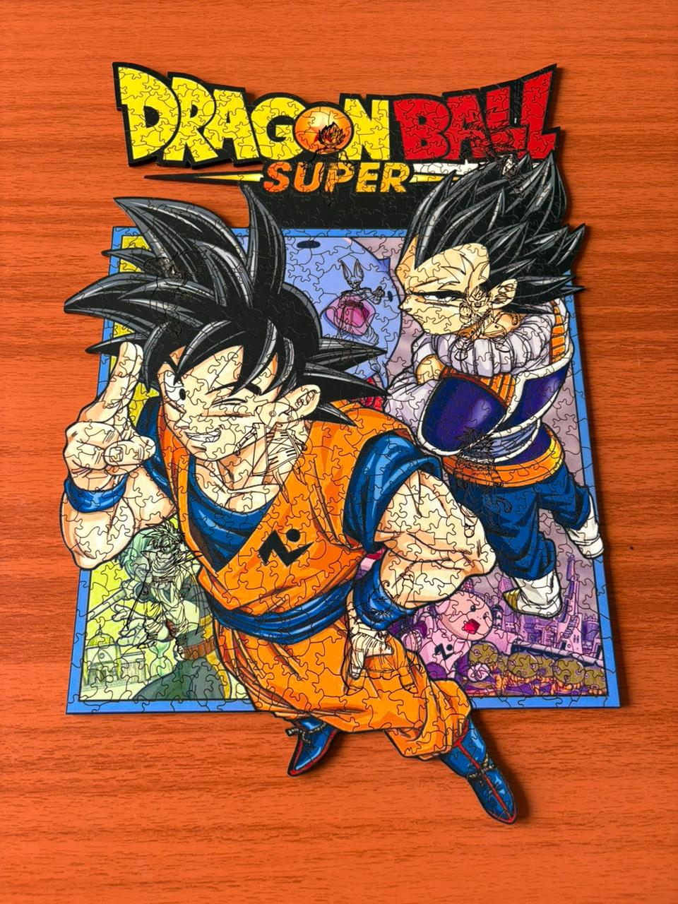

# Crea un encabezado de primer nivel

## Crea un encabezado de segundo nivel

### Crea un encabezado de cuarto nivel

**Texto en negrita**

texto normal

_texto con las barras de inicio y final son cursivas_

***Pon una palabra en negrita y cursiva a la vez***

| Esto debe de estar oculto

Esta es una frase con esta **palabra** en negrita.

<ins>Esta oracion debe de estar subrayada.</ins>

Esta es la oracion que tiene una ***palabra*** en cursiva y negrita

Crea un subíndice H2O

Crea un subíndice H2O

[Ir a Instagram de Rompedistintos](https://www.instagram.com/rompedistintos/reels/)

imagen de gato

>Esto es una cita de dos 
>lineas

> **Crea una lista con puntos:**
>- Este es el primer punto
>- Este es el segundo punto
>- Este es el tercer punto

